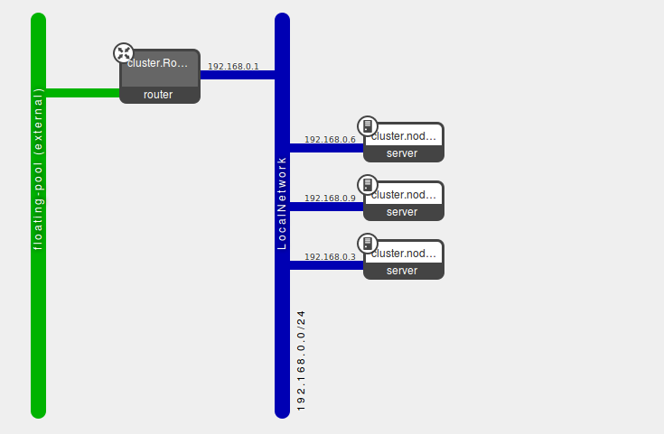

heat-cluster
-----------
Python script generates cloudformation template to bootstrap cluster using chef-server

 
`pip install cfn-pyplates, netaddr`

`cfn_py_generate template.py template.json`

`heat stack-create my_cluster -f template.json`
